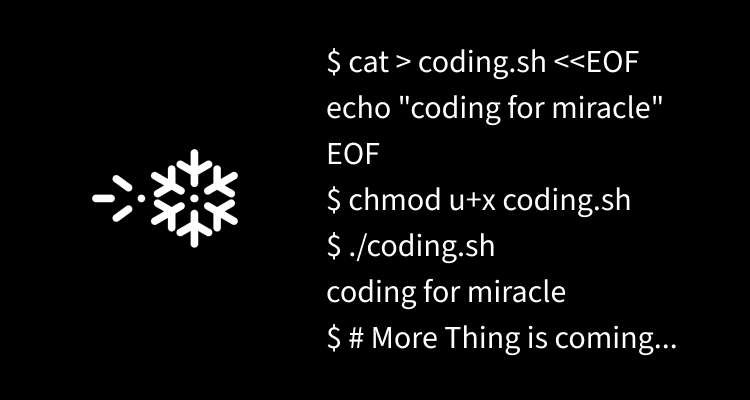

## Coding for miracle

### About me
I'm a software engineer with a passion for creating innovative solutions to complex problems. I have a strong background in computer science and a deep understanding of programming languages and algorithms. I'm always looking for new challenges and opportunities to learn and grow as a developer.

### My skills
I have a wide range of skills and expertise in various areas of software development, including:

- Front-end development using React, Nextjs, HTML, CSS, and JavaScript
- Back-end development using Spring on Java or learning Rust
- Other mini-cute app like cli program using Rust
- Database management using MySQL, PostgreSQL, ElasticSearch, and MongoDB
- Version control using Git
